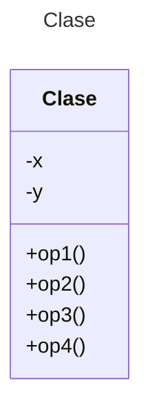

# Proyecto - Template Method

Extienda el diseño de su controlador automotriz del ejercicio del adaptador para que ahora se incluya una nueva operación en todos los motores: ```diagnosticar()``` para todos los motores (```Común```, ```Económico```, ```Eléctrico``` e ```Hibrido```) en el cual se implemente la forma de diagnóstico para cada uno de los motores. Se desea que sea un diagnóstico automático por computadora.

# Casos de Prueba

Están incluidos en su repositorio inicial de Github. Analice la especificación de casos de prueba que el Ingeniero de Pruebas ha diseñado para asegurar la correcta implementación de estos requisitos y programe lo necesario para pasar todas las pruebas. La especificación de prueba se ha realizado de acuerdo al Manual de operación de cada motor donde señala la forma correcta en que el diagnóstico se realiza dependiendo del tipo de motor.

## Diagrama de clases
[Editor en línea](https://mermaid.live/)

[Referencia-Mermaid](https://mermaid.js.org/syntax/classDiagram.html)

## Diagrama de clases UML con draw.io
El repositorio está configurado para crear Diagramas de clases UML con ```draw.io```. Para usarlo simplemente agrega un archivo con extensión ```.drawio.png```, das doble clic sobre el mismo y se activará el editor ```draw.io``` incrustado en ```VSCode``` para edición. Asegúrate de agregar las formas UML en el menú de formas del lado izquierdo (opción ```+Más formas```).

## Uso del proyecto con Maven

### Compilar
```
mvn -f app compile
```
### Probar N tests
```
mvn -f app test
```
### Probar 1 test
```
mvn -f app test -Dtest="AppTest#testDiagMotorComun"
mvn -f app test -Dtest="AppTest#testDiagMotorEconomico"
mvn -f app test -Dtest="AppTest#testDiagMotorElectrico"
mvn -f app test -Dtest="AppTest#testDiagMotorHibrido"
```
### Ejecutar App
```
java -cp app/target/classes miPrincipal.App
```
### Empacar App
```
mvn -f app package
```
### Limpiar binarios
```
mvn -f app clean
```
## Comandos Git-Cambios y envío a Autograding

### Por cada cambio importante que haga, actualice su historia usando los comandos:
```
git add .
git commit -m "Descripción del cambio"
```
### Envíe sus actualizaciones a GitHub para Autograding con el comando:
```
git push origin main
```
